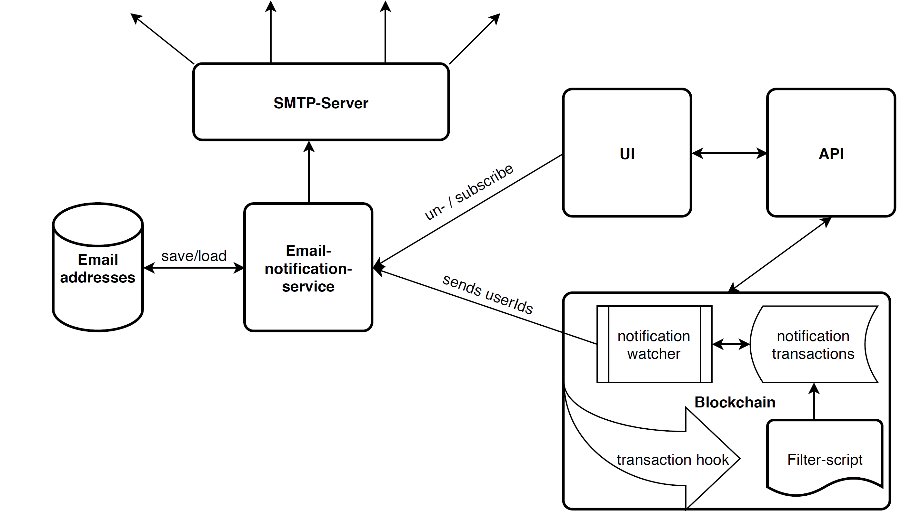

# Email-Notification-Service

The email notification service is responsible for saving/deleting email adresses per Trubudget user in a connected database. These email addresses are used to send configurable notifications to a connected SMTP server. If database and SMTP server are connected the notification.send endpoint can be used to send a user id. The database is checked if a email address is linked to the passed user id. If so a notificaiton is sent. It is recommended to start at the [Getting Started section](#getting-started)

## Database Configuration

This project is using knex to connect to the database where user email addresses are stored. Knex makes it possible to use a database you like unless it is supported.
Supported databases are:

| Database                   | Driver  |
| -------------------------- | ------- |
| PostgreSQL/Amazon Redshift | pg      |
| MySQL/MariaDB              | mysql   |
| SQLite3                    | sqlite3 |
| MSSQL                      | mssql   |

To install the driver for your database type in following command:

```
npm install <Driver> --save
```

## Environment Variables

| Env Variable  | Default Value                     | Description                                                                                                      |
| ------------- | --------------------------------- | ---------------------------------------------------------------------------------------------------------------- |
| PORT          | 8890                              | Port for HTTP Server                                                                                             |
| DB_TYPE       | pg                                | Type of database. A supported list can be found in the [Database Configuration section](#database-configuration) |
| DB_NAME       | trubudget_email_service           | Name of the database                                                                                             |
| DB_USER       | postgres                          | User name for connected database                                                                                 |
| DB_PASSWORD   | test                              | Password for connected database                                                                                  |
| DB_HOST       | localhost                         | IP of connected database                                                                                         |
| DB_PORT       | 5432                              | Port of connected database                                                                                       |
| DB_SCHEMA     | public                            | Schema of connected database                                                                                     |
| DB_SSL        | false                             | If true the DB connection is using the SSL protocol                                                              |
| USER_TABLE    | users                             | Name of the table which is created if the first email address is inserted                                        |
| SMTP_HOST     | localhost                         | IP of external SMTP-Server used to actually send notification emails                                             |
| SMTP_PORT     | 2500                              | Port of external SMTP-Server                                                                                     |
| SMTP_SSL      | false                             | If true the external SMTP-Server connection is using the SSL protocol                                            |
| EMAIL_FROM    | Trubudget Notification Service👻  | This is injected into the `from` field of the email notification                                                 |
| EMAIL_SUBJECT | Trubudget Notificaiton            | This is injected into the `subject` field of the email notification                                              |
| EMAIL_TEXT    | You have received a notification. | This is injected into the `body` of the email notification                                                       |
| LOG_LEVEL     | INFO                              | Defines the log output. Supported levels are `ERROR`, `WARN`, `INFO`, `DEBUG`                                    |
| JWT_SECRET    | - (required)                      | A secret of min length of 32 - It is used to verify the JWT_TOKEN sent by users of the email-service endpoints   |

## Architecture

As shown in the architecture section below, a script shall filter every transaction. This script is called `multichain-feed` and is part of the mono repository of Trubudget. The script filter transactions after notifications and saves them locally named with a timestamp as json files in the `/notifications` folder of the blockchain application.
An external process called `notification-watcher` watches the notifications folder and sends the user's ids parsed from the saved transactions via http request to the email service using the `notification.send` endpoint.
The email service checks if the connected database includes an email address for the passed user id. If an email address is found a notification is sent to the configured SMTP host.
Subscribing/unsubscribing to the email notification service can be handled by the user profile of the Trubudget frontend or by using the user.insert/user.delete endpoint of the email service.



## Email-Service

### Endpoints

| Method | Endpoint           | Description                                                    |
| ------ | ------------------ | -------------------------------------------------------------- |
| GET    | /readiness         | Checks if email service is ready                               |
| GET    | /user.getEmail     | Get email address of id if set in connected database           |
| POST   | /user.insert       | Insert an email address linked to the passed id                |
| POST   | /user.delete       | Delete an email address linked to the passed id                |
| POST   | /notification.send | Send a notification to passed id if email address is available |

#### /user.getEmail

| Query-Parameter | Description |
| --------------- | ----------- |
| id              | User id     |

#### /user.insert

Following json structure is used:

```json
{
  "apiVersion": "1.0",
  "data": {
    "user": {
      "id": "mstein",
      "email": "mstein@kfw.de"
    }
  }
}
```

#### /user.delete

Following json structure is used:

```json
{
  "apiVersion": "1.0",
  "data": {
    "user": {
      "id": "mstein",
      "email": "mstein@kfw.de"
    }
  }
}
```

#### /notification.send

Following json structure is used:

```json
{
  "id": "mstein"
}
```

## Getting Started

The easiest way to get started is to use our pre-set `docker-compose` cluster which starts the whole TruBudget application including all email components (that means you need to install [Docker](https://www.docker.com/community-edition#/download)).
The pre-set cluster contains:

- 1 Master-Node
- 1 Master API connected to Master-Node
- 1 Frontend connected to Master-API
- 1 Email-Service
- 1 Email-Database (Postgres)

When started the Email-Service sends email notifications to the configured SMTP-host. The default configuration is:

- SMTP_HOST: host.docker.internal(localhost)
- SMTP_PORT: 2500

To configure another database type for storing the user email addresses check out the [Database Configuration section](#database-configuration)
To check what is configurable check out the [Environment Variables section](#environment-variables)
If a local SMTP mail server for testing purposes is needed [mailslurper](https://github.com/mailslurper/mailslurper) can be used
