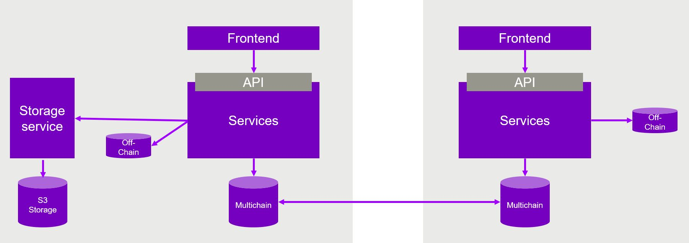
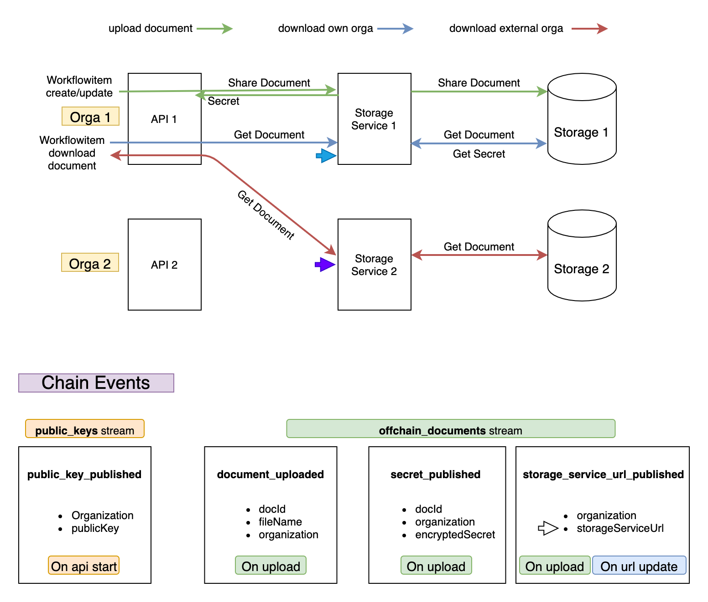

# Storage-Service

The storage service is responsible for saving/deleting/accessing documents to Minio, an external storage server.
It is an optional feature to share single documents between mutliple organizations. If there is only one organization, it is recommmended to use the normal offchain-storage.

## Environment Variables

To ensure all necessary environment variables are set correctly this section describes all environment variables across all services.

### Storage-Service

| Env Variable                | Default Value | Description                          |
| --------------------------- | ------------- | ------------------------------------ |
| STORAGE_HOST                | localhost     | IP address of storage service        |
| STORAGE_PORT                | 8090          | Port of storage service              |
| ACCESS_CONTROL_ALLOW_ORIGIN | "\*"          | CORS configuration                   |
| MINIO_ACCESS_KEY            | minio         | Access key for Minio server          |
| MINIO_SECRET_KEY            | minio123      | Secret (Password) for Minio server   |
| MINIO_PORT                  | 9000          | Port of connected Minio              |
| MINIO_HOST                  | localhost     | IP address of connected Minio server |

## Getting Started

### Start with Docker

The easiest way to get started is to use our pre-set [`docker-compose`](./docker-compose.yaml) cluster which starts the whole TruBudget application including the storage-service project (that means you need to install [Docker](https://www.docker.com/community-edition#/download)).
To start a new TruBudget instance with docker-compose, you need to naviage to `./storage` and set the environment variables in the `.env` file. Afterwards, start
the docker containers with `sh startDev.sh`.

The pre-set cluster contains:

- 1 Master-Node (Blockchain)
- 1 API connected to Master-Node
- 1 Frontend connected to API
- 1 Storage Service connectet to API
- 1 Minio server connectet to Storage-Service

### Start without Docker

To start the storage-service without docker, you need to start all desired service yourself with the right environmental variables. To set these environmental variables, read the documentation of the services. Nevertheless, you need to start the Minio server with docker (since we use a docker image). To start the Minio Server, use the [`docker-compose-minio`](./docker-compose-minio.yaml).

<!-- ## Encryption and Decryption -->

## Architecture

If an organization decides to use the external storage-service with minio, the documents that are stored in the offchain-storage can still by accessed (to keep backwards compatibilty).
To share and access documents between different nodes (organizations), we need two requirements fullfilled:

- Connect the node (blockchain) together
- Share the document secret and ID

### Document distribution

When documents are shared between multiple nodes (organizations), the particular nodes gets the decrypted keys of the documents. Then, the documents from the other node can be accessed by the storage-service through the API, which is exposed by the frontend (nginx).

The access of the documents are restricted by the secret, that means only nodes with a valid secret and document ID can access the document. Moreover, the document ID and encrypted secret are saved in the event secret_published in the offchain_documents stream.
To encrypt and decrypt this secret, RSA keypairs (public and private keys) are used. For more information, see [Public-key cryptography](https://en.wikipedia.org/wiki/Public-key_cryptography) on Wikipedia.

